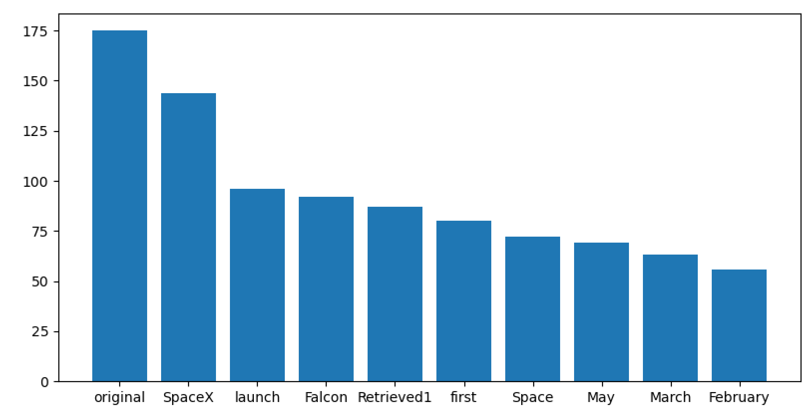

### ICE-1 Questions

---

## Team:

1. Michael Moore (me)
2. Taylor King ([link pending]())
3. Ashlyn Woodward ([link pending]())
4. Jibril Moalim ([link pending]())
5. Caleb Yoast ([link](https://github.com/Yostistoast11/CSCE-5290-Assign-1))

---

## Questions:

### 1. Why we use stopwords? Why stopwords are not necessary for NLP frequency distribution.

**Stopwords are used to make conversations flow easier and provide more context to situations. An example of this would be using was instead of is to talk about the past. We don’t use them in the frequency distribution because they don’t add value to the text, and thus aren’t relevant.**

### 2. Based on high frequency words what information you can extract from the graph?

**I can see that SpaceX had a launch a ship (falcon) in some time from February to May.**

### 3. Can you provide different visualization for frequency distribution? If yes, please perform. If no, why?

**Yes, see below**

